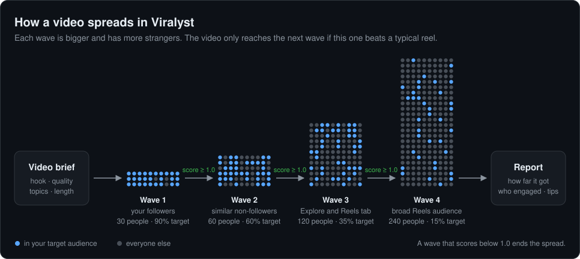
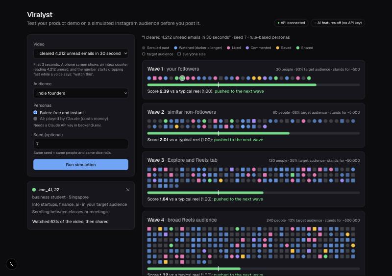
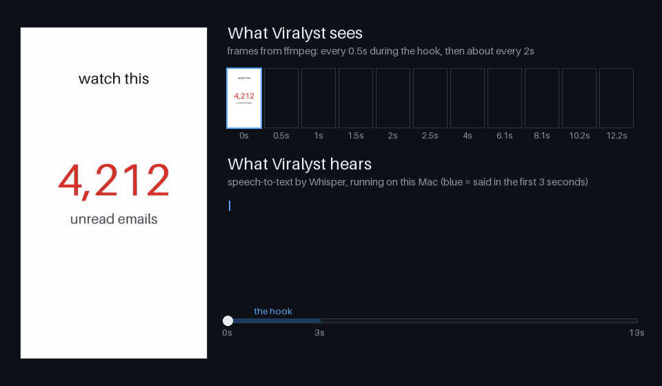
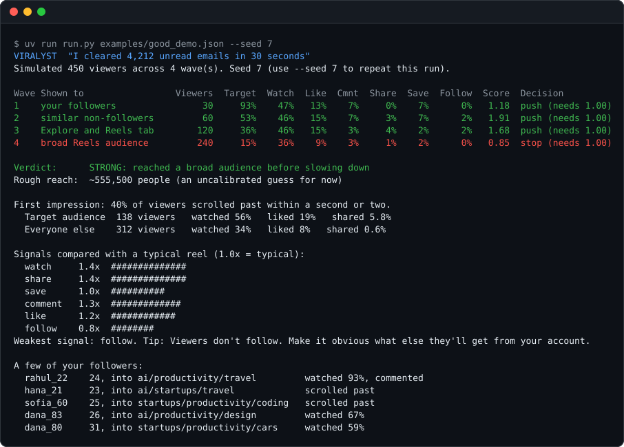
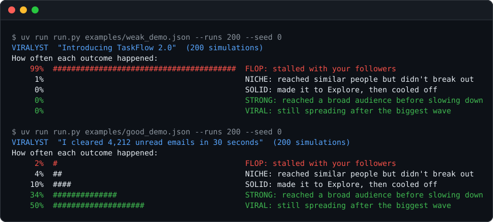
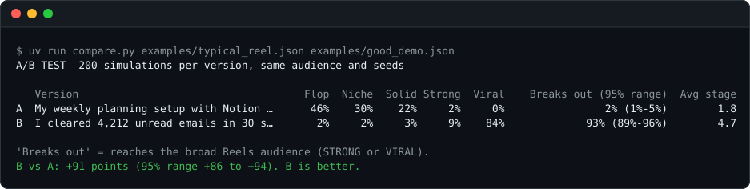

# Viralyst

**Test your product demo video before you post it.**

Viralyst simulates an audience of personas, inside and outside your target market, and an
Instagram-style algorithm that decides how far your video spreads. Get the odds of it taking off,
see who engaged, and learn what to fix before you publish.

<p align="center">
  
</p>

## How it works

1. **Analyze the video:** ffmpeg pulls out frames and audio, Whisper writes down what's said, and Claude
   rates the hook, quality and topics, and suggests a stronger opening line.
2. **Wave 1 reacts.** Each persona scrolls past, or watches, likes, comments, shares, saves or follows.
3. **The algorithm scores the wave** against a typical reel. Shares and watch time count most.
   Beat it and the video moves to a bigger, broader wave. Otherwise it stops.
4. **Read the report:** how far it got, which audiences engaged, and your weakest signal with a fix.

## The website

<p align="center">
  
</p>

Watch the audience react wave by wave. Every dot is a simulated viewer: its color shows what they did,
and you can click it to meet them. Then read the verdict, see the odds over 200 runs, or upload your own
video. Every run gets a link that reproduces it exactly.

## From a real video

<p align="center">
  
</p>

Viralyst samples frames where viewers decide (every half second in the first 3 seconds) and
transcribes the voiceover with Whisper, both on your machine. Claude then turns them into the video brief.
[Watch the sample with sound](backend/examples/sample_demo.mp4).

## Example

<p align="center">
  
</p>

One run is one possible future, so run it many times to see the odds:

<p align="center">
  
</p>

## Compare versions (A/B test)

<p align="center">
  
</p>

Every version meets the same simulated people. Viralyst reports how sure it is and says
"too close to call" when the difference could be luck.

## Quick start

Requires [uv](https://docs.astral.sh/uv/), [Node.js](https://nodejs.org) and [ffmpeg](https://ffmpeg.org) (`brew install ffmpeg`). The AI features also need a [Claude API key](https://console.anthropic.com/settings/keys) in `backend/.env` (see `backend/.env.example`).

Start the website (the API and the web app together), then open http://localhost:3000:

```bash
./dev.sh
```

Or use the command line:

```bash
cd backend
uv run run.py examples/good_demo.json            # one simulation
uv run run.py examples/weak_demo.json --runs 200 # the odds
uv run run.py examples/good_demo.json --agent ai # AI personas played by Claude
uv run build_audience.py "who it's for" --out examples/mine.audience.json
uv run analyze_video.py examples/sample_demo.mp4 --out examples/sample_demo.json --voiceover
uv run compare.py examples/typical_reel.json examples/good_demo.json   # A/B test
uv run calibrate.py calibration/results.csv      # check against your real results
uv run pytest                                    # run the tests
```

## Project structure

```
backend/    Python: simulation engine, web API, command-line tools and tests
frontend/   Next.js website: live cascade, report, odds and video upload
docs/       Step-by-step lessons and README images
dev.sh      Starts the API and the website together
```

## Roadmap

- [x] **Phase 1:** Simulation engine with rule-based agents
- [x] **Phase 2:** AI personas (Claude) that decide and write comments
- [x] **Phase 3:** Realistic personas and an audience builder from a plain-English description
- [x] **Phase 4:** Video understanding (frames, Whisper transcript, Claude vision, Supertonic voiceover)
- [x] **Phase 5:** Web API and website with a live view of the cascade
- [x] **Phase 6:** A/B tests, measured benchmarks, and calibration against real results
  (the tools are ready; calibration waits for real data in `backend/calibration/results.csv`)
- [ ] **Phase 7:** Deploy
